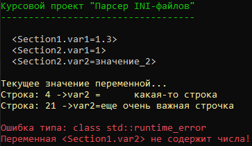

# Курсовой проект «Парсер INI-файлов»

Курсовой проект — простой парсер файлов формата INI.

Супер короткое описание...

---

### Содержание файла:
```
[Section1]
; комментарий о разделе
var1=5.0 ; иногда допускается комментарий к отдельному параметру
var2 =	какая-то строка
  
[Section2]
var1=1
var 2 =	значение_2

; Иногда значения отсутствуют, это означает, что в Section3 нет переменных 
[Section3]
[Section4]
Mode=
Vid=
Mode=  ok	 

; Секции могут повторяться
[Section1]
;var1	;какой то комментарий
var3=значение
var2=еще очень важная строчка
var1	   =		1.3 текст ; переприсваиваем значение
```

### Результат работы программы:


